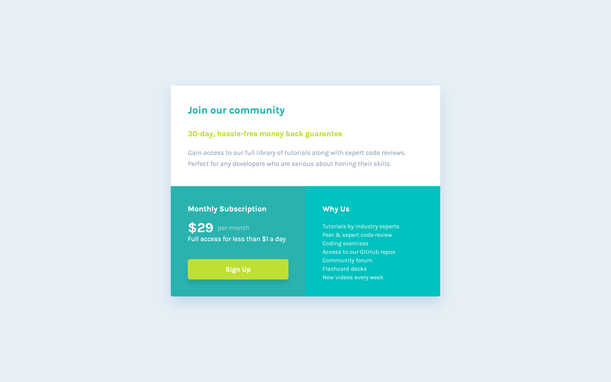

# Frontend Mentor - Stats preview card component solution

This is a solution to the [Single price grid component challenge on Frontend Mentor](https://www.frontendmentor.io/challenges/single-price-grid-component-5ce41129d0ff452fec5abbbc). Frontend Mentor challenges help you improve your coding skills by building realistic projects.

## Table of contents

- [Overview](#overview)
  - [The challenge](#the-challenge)
  - [Self assigned challenges](#self-assigned-challenges)
  - [Screenshot](#screenshot)
  - [Links](#links)
- [My process](#my-process)
  - [Built with](#built-with)
  - [What I learned](#what-i-learned)
  - [Continued development](#continued-development)
  - [Useful resources](#useful-resources)
- [Author](#author)
- [Acknowledgments](#acknowledgments)

## Overview

### The challenge

Users should be able to:

- View the optimal layout depending on their device's screen size

### Self assigned challenges

- Use BEM to organise CSS.

### Screenshot

### Links

- [Solution URL](https://www.frontendmentor.io/solutions/single-price-grid-component-Hq-kZFvsNa)
- [Live Site URL](https://sh-single-price-grid-component.netlify.app/)

## My process

### Built with

- Semantic HTML5 markup
- CSS custom properties
- Flexbox
- CSS Grid

### What I learned

- That I'm ready to take on more challenging designs than this.

- Using CSS methods like BEM can really slow me down, but I'm sure it'll be worth it in the long run and that I'll get faster as time goes on/it'll be necessary in the future.

- How to make a layout like this work in flexbox without using media queries! Took some trial and error with the `flex-grow` and `flex-shrink` values but got there in the end 💪

### Continued development

- Remember there's no such thing as `justify-self` with flexbox. Instead, you can just use `margin: auto` for whichever direction you need 👀
- Start using `clamp()` more often for responsive layouts where dimensions/sizing need to change.

## Author

- Website - [Sam Hemingway](https://samhemingway.dev)
- Frontend Mentor - [@SamHemingway](https://www.frontendmentor.io/profile/samhemingway)

### Acknowledgements

- Thanks to Alex Marshall on the FEM slack channel for teaching me about clamp() when I was curious how to achieve dynamic font-sizing/padding.
